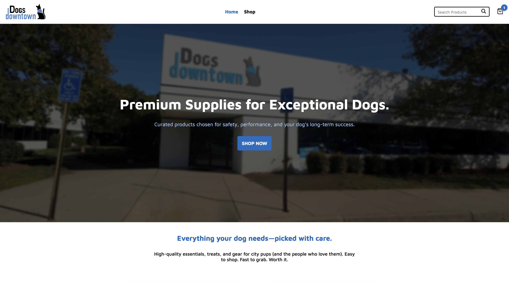

<div align="center">
  <br>
  <h1>Dogs Downtown — Shopping Cart</h1>
  <br>
  <div>
    
    
    
    
    
  </div>
  <br>
  <h3><b><a href="https://top-shopping-cart-63z.pages.dev/">🔗 View Live Demo</a></b></h3>
</div>

## 📖 Overview

A **pet product e-commerce application** themed around [Dogs Downtown](https://www.dogsdowntownva.com/), built as part of [The Odin Project](https://www.theodinproject.com) curriculum. Users can browse products by category, search for items in real time, add them to a cart with quantity controls, and view a cart summary with totals.

Through this project, I practiced:

- Building a multi-page React application with React Router (nested routes, outlet context, dynamic params)
- Writing and maintaining a comprehensive unit test suite with Vitest and React Testing Library
- Managing shared state across routes using `useOutletContext`
- Creating custom hooks for data fetching and cart mutations (`useFetchProduct`, `useFetchProducts`, `useChangeProductQuantity`)
- Mocking modules, hooks, and child components in tests to isolate unit behavior
- Responsive design with CSS Modules and media queries

> 📘 [Assignment Instructions](https://www.theodinproject.com/lessons/react-new-shopping-cart)

---

## 🕹️ How to Use

- **Browse** products on the shop page or filter by category
- **Search** for products using the real-time search bar in the navbar
- **Click** a product to view its details (image, description, price)
- **Add to Cart** and adjust quantities with the increment/decrement selector
- **View Cart** to see items, subtotal, shipping, and total
- **Remove** items from the cart directly

## ✨ Features

- Real-time product search with live filtering and result count
- Product browsing by category with dynamic routing
- Quantity selector with optimistic UI updates and server sync
- Cart page with subtotal, shipping, and total calculations
- Loading skeletons and spinners for async states
- Error handling with retry UI and React Router error boundaries
- Responsive layout with separate desktop and mobile search bars
- "About Us" branding section with Dogs Downtown storefront imagery

---

## 📸 Screenshots

| Desktop                                 |
| --------------------------------------- |
|  |

## 🔧 Tech Stack

**Built With:**

- React 19
- React Router 7
- CSS Modules
- Vite
- Vitest + React Testing Library

## 🛠️ Libraries / Assets

JavaScript Libraries:

- react-loading-skeleton (loading placeholders)
- react-loader-spinner (TailSpin, ThreeDots, ProgressBar spinners)
- react-icons (FaPlus, FaMinus, LuShoppingBag, FaMagnifyingGlass, IoClose)

---

## 🧠 What I Learned

- How to structure component tests as unit tests by mocking child components and asserting on props passed via `toHaveBeenLastCalledWith`
- The distinction between unit and integration tests in React: mocking a child tests _your_ component's logic; rendering the real child tests the combined behavior
- `vi.mock` path must match the import path in the component under test, not the test file
- `useParams` always returns strings — coercing to `Number` is necessary for comparisons
- `structuredClone` prevents mutation of input data in hooks that transform state
- `expect.anything()` doesn't match `undefined` — use `undefined` explicitly when matching React's ref argument
- `expect.objectContaining` and `expect.arrayContaining` for partial prop matching
- Outlet context is just a prop on `<Outlet>` — testable like any other component prop via mock assertions

## 🧪 Notes

- Product data is fetched from `fakestoreapiserver.reactbd.org` (migrated from the now-defunct `fakestoreapi.com`)
- Cart mutations hit `dummyjson.com/carts/1` — the API simulates PUT requests but doesn't persist changes
- The `useChangeProductQuantity` hook returns updated cart data from the function call rather than storing it in state, giving the caller control over when to update
- Both desktop and mobile search bars exist in the DOM simultaneously, toggled via CSS media queries at 660px

## 🛣️ Roadmap

- Migrate to TypeScript
- Add persistent cart state (localStorage or backend)
- Implement checkout flow
- Add product ratings and reviews display

---

## 📦 Installation

### 1. Clone the repository

```bash
git clone https://github.com/LintonRobinson/TOP-Shopping-Cart.git
```

### 2. Navigate into the project folder

```bash
cd TOP-Shopping-Cart
```

### 3. Install dependencies

```bash
npm install
```

### 4. Start the development server

```bash
npm run dev
```

### 5. Run tests

```bash
npm run test
```

### 6. Build for production

```bash
npm run build
```

## 🗂️ Folder Structure

```bash
TOP-Shopping-Cart/
│
├── 📁 public/                    # Static assets
│
├── 📁 src/
│   ├── 📁 assets/                # Images and static files
│   ├── 📁 components/
│   │   ├── 📁 layout/            # Navbar, Footer
│   │   └── 📁 ui/                # AboutUs, CartProductItem, ProductCard,
│   │                               ProductQuantitySelector, ProductSearchBar
│   ├── 📁 hooks/                 # useFetchProduct, useFetchProducts,
│   │                               useChangeProductQuantity
│   ├── 📁 pages/                 # HomePage, CategoryPage, ProductPage,
│   │                               UserCartPage, ErrorPage
│   ├── 📄 App.jsx                # Root layout with cart state and Outlet
│   ├── 📄 App.css                # Global styles
│   ├── 📄 routes.jsx             # Route configuration
│   └── 📄 main.jsx               # Entry point
│
├── 📄 package.json
├── 📄 vite.config.js
├── 📄 eslint.config.js
└── 📄 .gitignore
```

---

## 🙋‍♂ Author

### Linton Robinson

- GitHub: [@LintonRobinson](https://github.com/LintonRobinson)

## 📄 License

This project is licensed under the MIT License. See the LICENSE file for details.
